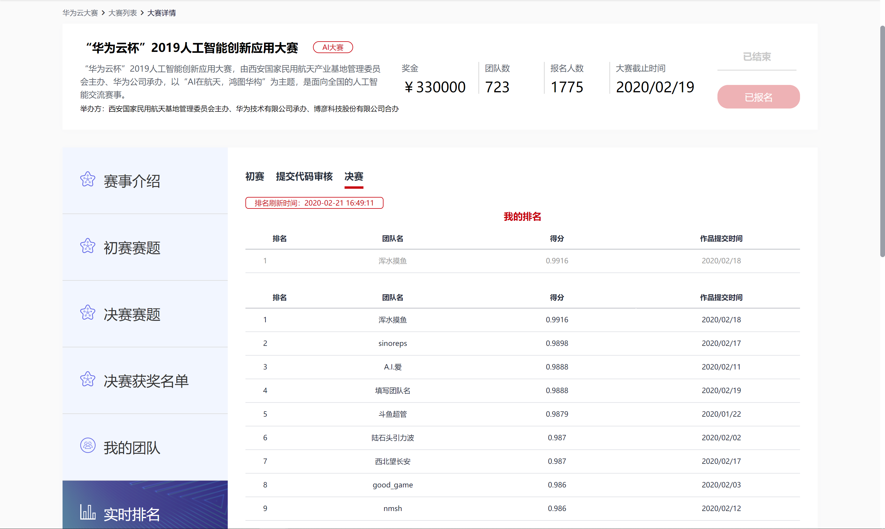
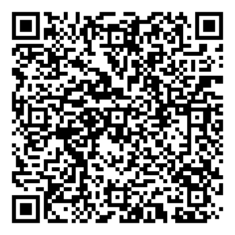

# Miniprogram-xian

本项目是华为云创新大赛以西安旅游为主题，利用人工智能技术，对西安的热门景点、美食、特产、民俗、工艺品等图片进行分类，此仓库主要用于微信小程序展示。

**决赛排名：**

**小程序展示：**
> 由于个人开发者不能够发布`文娱-资讯`相关内容，因此我们对于线上版本进行了功能阉割，您可以在体验版中体验所有内容，如果需要体验权限，请直接给管理员发请求。

#### 线上发布版链接

#### 预览版

> 线上发布版删除了咨询推送功能，但是所有人都可以访问，您也可以通过微信端搜索`识秦通`找到正式发布版本的小程序。

**详情请见`应用说明文档.pdf`文档**

## Contact

shp395210@outlook.com